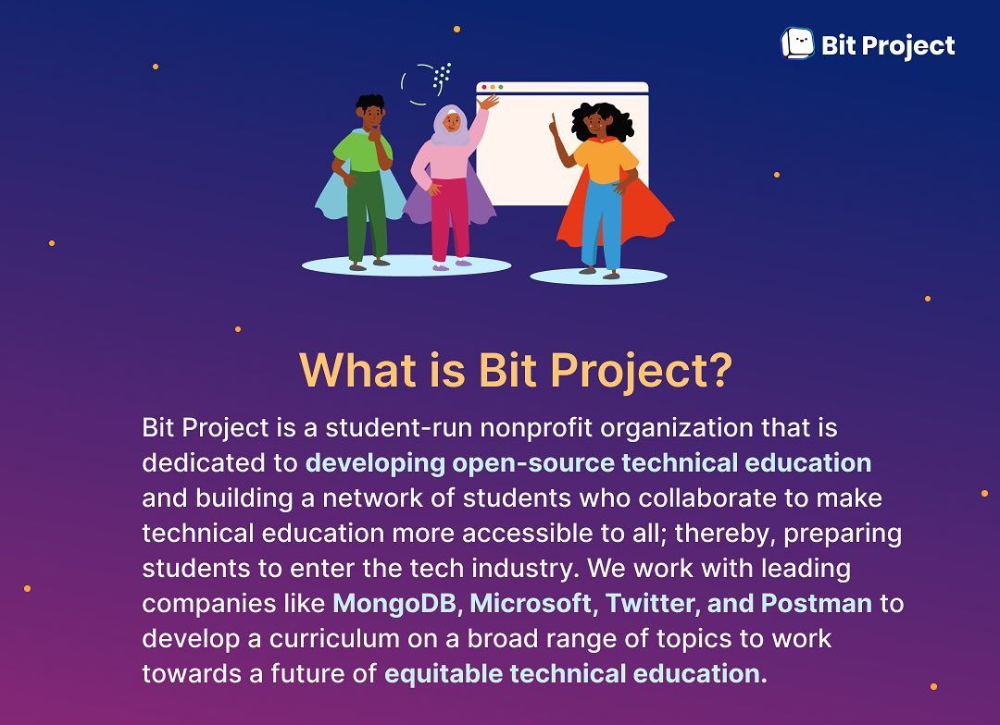

#Bit Project

Bit Project's aim is to integrate hands-on STEAM (Science, Technology, Engineering, Arts, and Mathematics) projects into elementary school classrooms. We help teachers who don't have specialized training in STEM by incorporating creative robotics activities that encourage students to learn problem-solving skills while also reinforcing previously learned concepts to maximize retention.

 

##To learn more: [Bitproject.org](https://bitproject.org/)