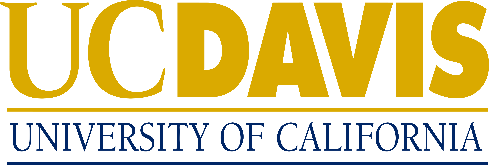

#Browser Fingerprinting Reasearch 
UC Davis (Industry collaborators: Apple, Mozilla)

####Objective:

Existing browser fingerprinting detection approaches rely on static or dynamic analysis of JavaScript code. However, they are not robust against code obfuscation. The goal of this project is to study the impact of obfuscation and develop obfuscation-resistant fingerprinting detection approaches.

####Goal & Educational Objectives:

This research is going to allow me to gain hands-on experience of real-world security and machine learning applications. For this research, I will participate in weekly meetings as well as contribute in any possible ways, whether it is to write code to automate the generation of obfuscation dataset, gain an in-depth understanding of the state-of-the-art FP-Inspector tool, and to improve FP-Inspector by implementing a obfuscation code detection module. This project will also allow me to get experience working in a research setting with other researchers.

####Motivation:

From my previous programming experience, I have learned Python, C++, Html, CSS, and Javascript. Since this research is mainly focused on analyzing Javascript, I feel I could put my skills to test and allow me to expand my knowledge on this field.

####Project Plan:

- We will first understand and learn the inner workings of FP-Inspector, as well as, popular JavaScript obfuscation tools. 
- We will then research different available obfuscators and analyze which ones are most likely to impact FP-Inspector’s accuracy. 
- Next, we will gather a dataset of both obfuscated and non-obfuscated fingerprinting scripts using different automated obfuscators. 
- Using this dataset, we are going to put the FP-Inspector to test and evaluate its robustness against different obfuscators. 
- Finally, we plan to improve FP-Inspector’s design and implementation by using the insights we have gained thus far from aforementioned steps.
