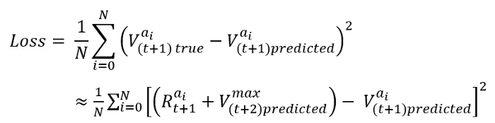
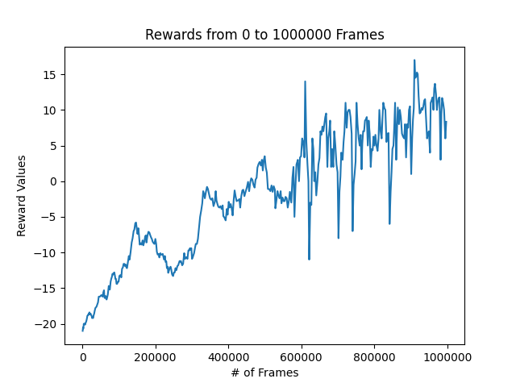
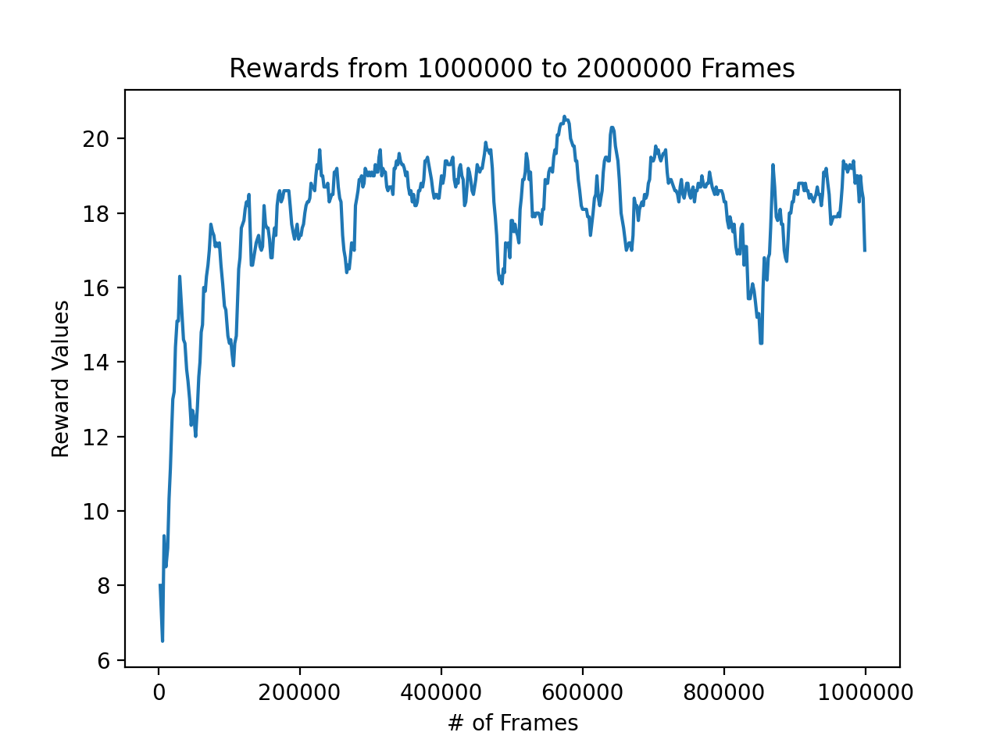
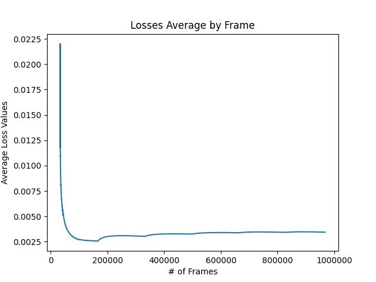

#Creating Atari Pong AI Using Deep Reinforcement Learning 

Modern approaches to AI step away from methods requiring domain experts. This allows models to not only learn better policies, such as beating humans at go, but also learn policies for domains in which encoding human knowledge is near impossible. 

For this project, I trained a model to learn to play Pong without human knowledge of the game. I used the OpenAI gym to run and interact with the Pong Atari game and the deep Q-learning algorithm. I have made modifications to improve its ability to learn and train the provided pre-trained model to acceptable performance.

Environment and Setup  
Google Cloud platform was used to run the Deep Learning Virtual Machine along with TensorFlow 1.13 framework.

###Loss Function  

The target model is used to generate the targets for our loss function. After a certain amount of eposides, the weights our main model will get adjusted to the target model weights.

 
 

###Results

<a href="https://github.com/rayngan999/Deep-Q-Learning-of-Atari-Pong
"> Github Link </a>
